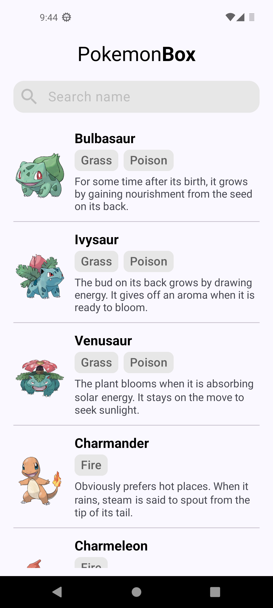
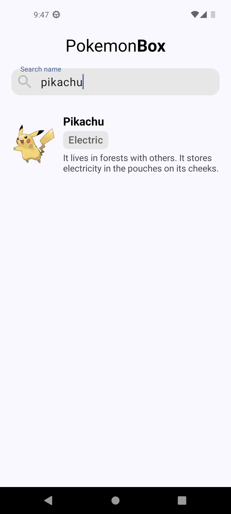
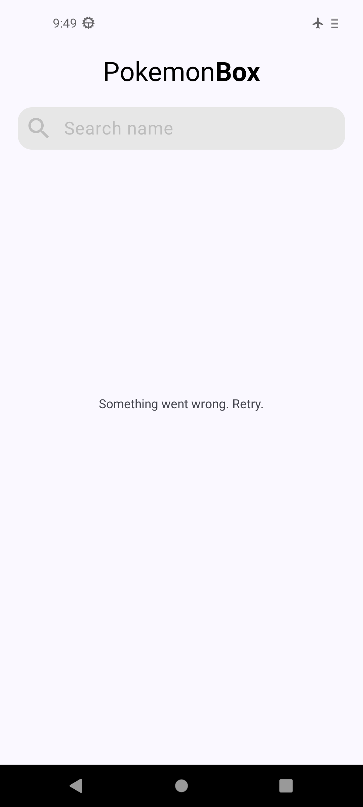
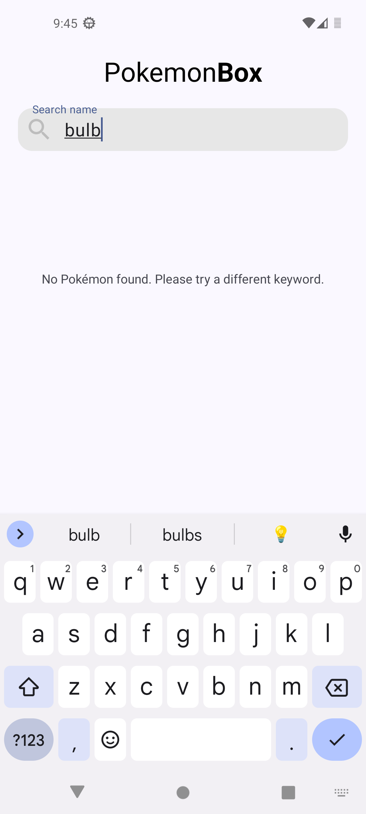

## Description

The project use MVVM Architecture and is structured into 3 layers:
- **UI** - Activity, Fragment, ViewModel, Navigator
- **Domain** - bridge between the data and UI, facilitates app logic
- **Data** - Repository, PagingSource, Network Data Source

Also have:
- Dependency Injection with Hilt Dagger
- Unit test for repository

For technical reasons related to the backend structure, the app alternates between using a `RecyclerView` and a standalone `ViewHolder` layout to show search result.

Error states are managed for both paging and search operations with different messages.

## Screenshots

  
  
  
  

## Tech stack & open-source libraries
- Min SDK level 26
- [kotlinx.coroutines](https://github.com/Kotlin/kotlinx.coroutines)
- [Retrofit](https://github.com/square/retrofit)
- [Gson](https://github.com/google/gson)
- [Glide](https://github.com/bumptech/glide)
- [Dagger Hilt](https://dagger.dev/hilt/)
- [Material Design 3](https://m3.material.io/)
- [Paging3](https://github.com/androidx/androidx/tree/androidx-main/paging)
- [FragmentViewBindingDelegate-kt](https://github.com/Zhuinden/fragmentviewbindingdelegate-kt)- kotlin library that simplifies the use of view binding in fragments
